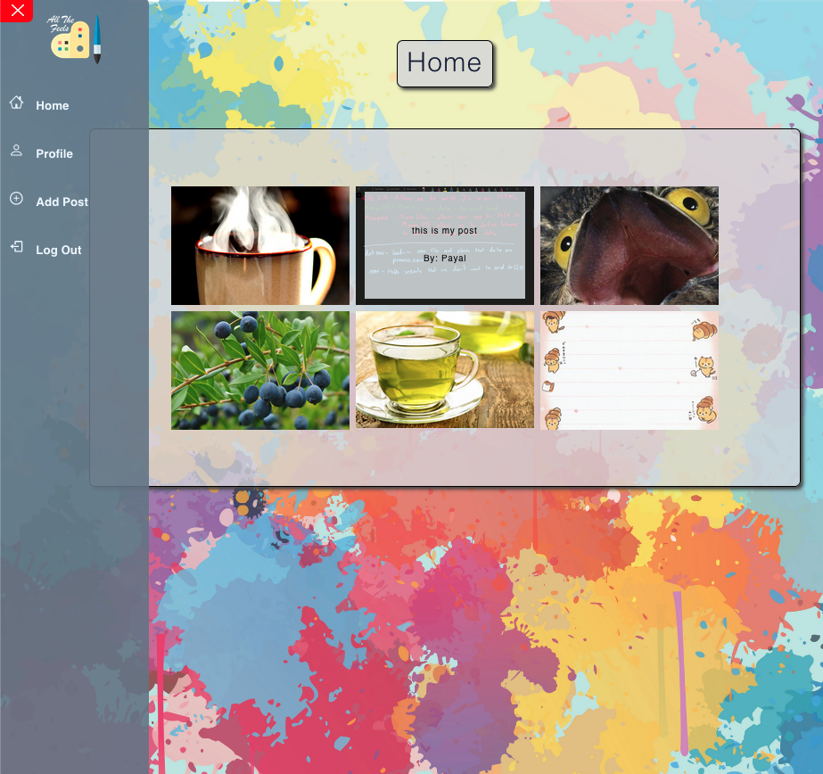
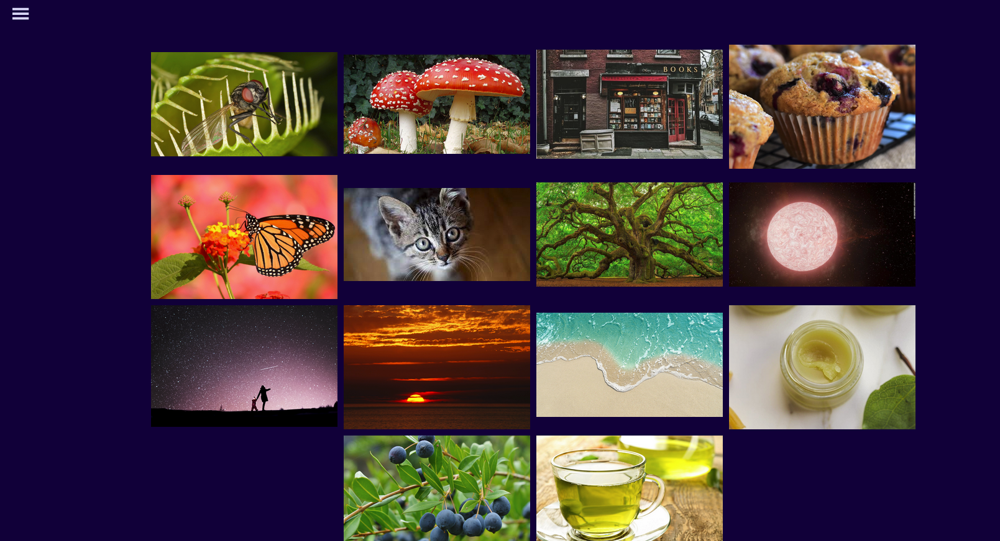
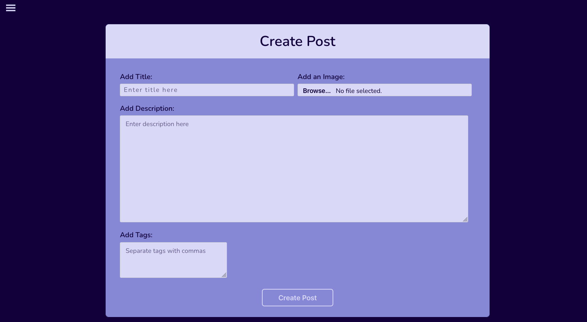
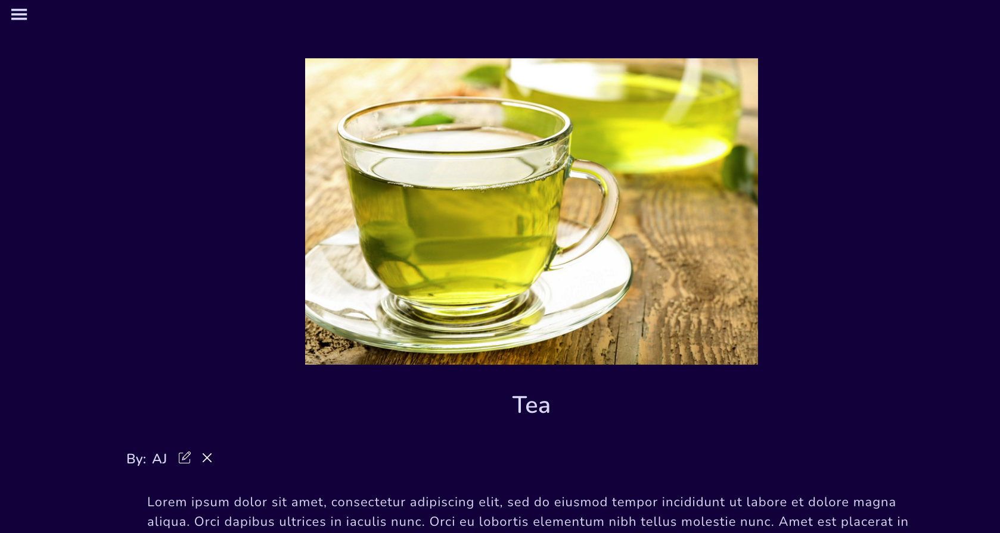
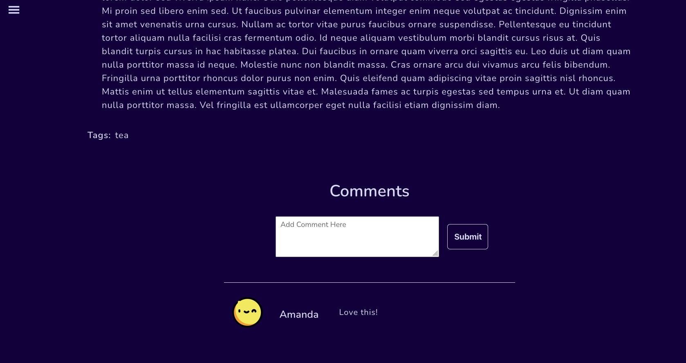

<h1>All The Feels</h1>
The percentage of people who experience symptoms of depression is highest among adolescents and young adults. Self expression through art is proven to relieve stress and significantly decrease anxiety, depression, and suicidal thoughts.

A supportive community is one of the most important emotional resources a person can have. All the Feels is a website that creates a place where adolescents can share their drawings, sketches, doodles, stories, and feelings.  

The updated application is deployed <a href="https://allthefeelsapp.herokuapp.com/">here</a>.
 

There have been improvements and edits made to this application. The original group project before these modifications can be found <a href="https://allthefeelsapp.herokuapp.com/">here</a>.
 

Click <a href="https://trello.com/b/gQTYPmew/all-the-feels">here</a> to view the ERD and wireframe.
 

<h2>Screenshots</h2>

 

<h2>Technologies</h2>
<ul>
  <li>React</li>
  <li>JavaScript</li>
  <li>HTML</li>
  <li>CSS</li>
  <li>Express</li>
  <li>NodeJs</li>
  <li>Heroku</li>
  <li>MongoDB</li>
  <li>Cloudinary</li>
</ul>

 

<h2>Future Improvements</h2>
<ul>
  <li>Add a search function to allow users to find posts via the tags.</li>
  <li>Add a feature to favorite a post.</li>
  <li>Add an "Are you sure you want to delete this" message when a delete button is clicked.</li>
</ul>

 

<h2>Credits</h2>
<ul>
  <li><b>Icons: </b></li>
    <ul>
      <li><a href="https://www.flaticon.com/free-icons/edit" title="edit icons">Edit icons created by Kiranshastry - Flaticon</a></li>

  <li><a href="https://www.flaticon.com/free-icons/emotion" title="emotion icons">Emotion icons created by Freepik - Flaticon</a></li>

  <li><a href="https://www.flaticon.com/free-icons/emotional" title="emotional icons">Emotional icons created by Flat Icons - Flaticon</a></li>
    </ul>
  <li><b>Template for Home and Profile Page: </b><a href="https://www.codepen.io/sashatran/pen/aJvaEG?editors=1100">sashatran on Codepen</a></li>
  <li>We wanted to thank <a href="https://github.com/slavdefense/Backlog-MERN-Stack">slavdefense, mbedard0, and williambennett321</a> for their help in assissting with image upload.</li>
</ul>

  